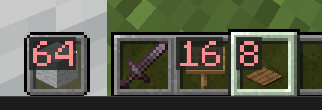

# Better Stack count

Simple minecraft mod which let you customise the item stack count text/ number (in inventory&hotbar)

example configuration. You can change it to ur preferences :)

### Download

download from release or [Modrinth mod page](https://modrinth.com/mod/better-stack-count)

### settings:

- size
- font
- colour/ opacity
- position
- background

I always find the item stack count a bit too big for smaller screen which hides the item. I also like to have a different colour and background so i made this mod.

### state:
Currently versions before 1.20 is not supported. Feel free to fork and update/ downgrade this mod.

If found a bug you can drop an issue on github or contact me from discord